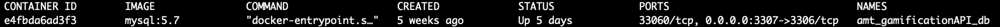
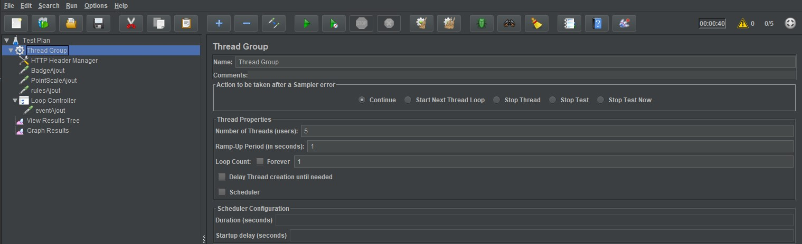
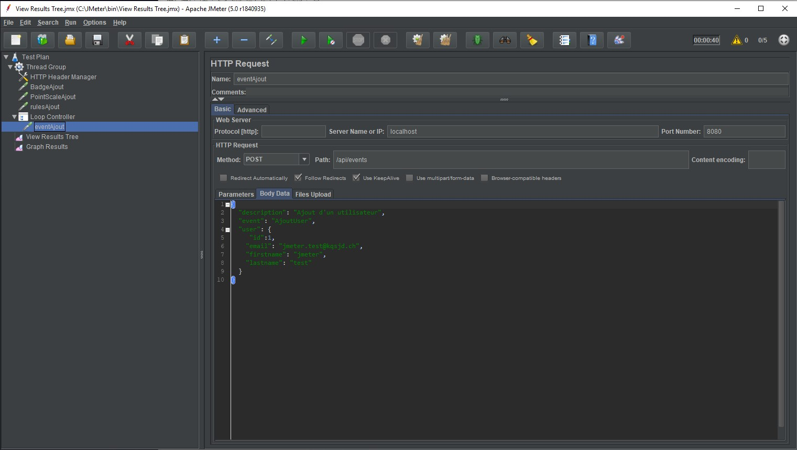
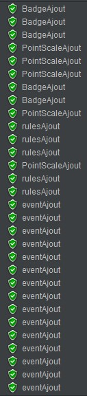
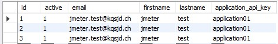
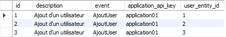

#AMT - Gamification via an API REST

__Authors__: Steve Henriquet, Yann Lederrey, Patrick Neto and Joël Shär.


## Overview

This repo contains a complet infrastructure to run a simple domain model exposed via an API REST, that can be accessed with an API Key. The domain modelize a simple gamification engine that uses typical game elements and mechanics, relevant to improve user experience in various types of application.


## Getting started

Before getting started with the tools, lets take a look at the project structure. In the root level, we have two main directories:

- `docker`: this directory contains the docker configuration files to build à MySQL Server, used to store the data exposed via the REST API. A complete "dockerized" infrastructure to run the Gamification API is available in the directory `gameapi_docker`.
- `swagger`: this directory contains the core of the project: the `spring-server` that will be used to make the API REST service available and the `gametown-specs` directory that contains the API specification, the source code to generate the code needed to run the service.

### Use the components separately

####Run the database service

1) First of all, we need to make a database available to use the infrastructure. For this, a "dockerized" MySQL is used. Let's begin by typing the command:

```bash
cd docker
```

to access to the docker configuration file.

2) For this step, you need Docker tool in your machine (if not, let's download it [here](https://www.docker.com/get-started) ). Verify if the `docker-compose.yaml` is in your repertory you are, and run the command:

```bash
docker-compose up
```

You need to make sure that the port 3307 is not yet used. The needed schema and data will be automatically populated in a database named `GamificationAPIDatabase`. The docker container wil use it to expose the MySQL server. Make sure the container is effectively started by typing:

```bash
docker ps
```

You should have an output like this:



To make sur that the database is effectively available and populated, you need to access in the conainer. For this, you can run the command:

```bash
docker exec -it amt_gamificationAPI_db /bin/bash
```

Once the bash of the container started, you can access to the mySQL server by typing:

```bash
mysql -p
```

(a password is needed. Juste type `root`). 

#### Run the Spring Boot Server

In the root directory of the repo, let's type de command:

```bash
cd swagger/spring-server/
```

To access at the spring-server project, containing the API Rest implementation. To run the server, juste run the command:

```bash
mvn spring-boot:run
```

Make sure that the port 8080 isn't yet used. Once started, the server will run at the adress http://localhost:8080/api, and will rend a page like that:


###The easy way

Like mentionned earlier, a "ready to use" dockerized infrastructure is available. To run that, you simply need to type the command:

```bash
cd docker/gameapi_docker/
```

To access to the `docker-compose.yml` that will be used to run the containers. Let's type the following command to run the infrastructure:

```
docker-compose up
```

You can access to the service a the same address: http://localhost:8080/api.

###Send a request to the API Rest

You can use curl to invoke the endpoints:

- To retrieve the list of badges (for example) previously created:

  ```
  curl -X GET --header 'Accept: application/json' --header 'apiKey: application01' 'http://localhost:8080/api/users'
  ```

  **Attention:** the access of the API REST is restricted. You need to add the key `application01` in query parameter `apiKey`. 

- To create a new badge (beware that in the live documentation, there are extra \ line separators in the JSON payload that cause issues in some shells)

  ```
  curl -X POST --header 'Content-Type: application/json' --header 'Accept: application/json' --header 'apiKey: application01' -d '{"active": true, "id": 2, "name": "badge02"}' 'http://localhost:8080/api/badges'
  ```


## Testing the Gamification API REST

Nous avons fais deux niveau de tests.

Des tests simples qui consites à vérifier que lorsque on CREATE/UPDATE/DELETE/GET un élément on reçoit le status code adéquat.

Des tests avancé qui consiste à vérifier le comportement de notre programme via les appels à l'API, par exemple que lorsqu'on crée une Rule avec seulement un badge, on vérifie que le badge est pas null mais le pointScale oui.

On a utilisé des TimeStamps dans les noms de certains objets créer afin d'assurer de récupéré le bon dans les tests.

Tests effectués dans les grandes ligne :

- Badges
  - Creation d'un badge 
    - test du status code : 201
    - test avancé : vérifier qu'il a bien été créé en le récupérant
  - Get d'un badge
    - test du status code : 200
    - test avancé : vérifier que le badge que l'on reçoit est bien le bon.
  - Update d'un badge
    - test du status code : 202
    - test avancé : vérifier que le badge que l'on reçoit a bien été modifié.
  - Delete d'un badge
    - test du status code : 204
    - test avancé : vérifier que le badge n'existe plus.
- PointScales
  - Creation d'un pointScale
    - test du status code : 201
    - test avancé : vérifier qu'il a bien été créé en le récupérant
  - Get d'un pointScale
    - test du status code : 200
    - test avancé : vérifier que le pointscale que l'on reçoit est bien le bon.
  - Update d'un pointScale
    - test du status code : 202
    - test avancé : vérifier que le pointScale que l'on reçoit a bien été modifié.
  - Delete d'un pointscale
    - test du status code : 202
    - test avancé : vérifier que le badge n'existe plus.
- Rules
  - Création d'une rule avec un badge
    - test du status code : 201
    - test avancé : vérifier qu'elle a bien été crée et qu'elle contient un badge et pas de pointScale.
  - Création d'une rule avec un pointScale
    - test du status code : 201
    - test avancé : vérifier qu'elle a bien été crée et qu'elle contient un pointScale et pas de badge.
  - Création d'une rule avec badge et un pointScale
    - test du status code : 201
    - test avancé : vérifier qu'elle a bien été crée et qu'elle contient un pointScale et un badge.
  - Get d'une rule
    - test du status code : 200
    - test avancé : vérifier que l'on récupère au moins une rule et qu'elle n'est pas  null.
  - Update d'une rule
    - test du status code : 202
    - test avancé : vérifier que l'update de la rule a bien été effectué.
  - Delete d'une rule
    - test du status code : 204
    - test avancé : vérifier que le delete de la rule a bien été effectué.
- Users
  - Get d'un user créé au préalable via un event.
    - test du status code : 200
    - test avancé : vérifier que l'on arrive à retrouve le user crée via l'event dans le retour du Get.
- Events
  - Création d'un event
    - test du status code : 200
    - test avancé : vérifier que le user lié à l'event a bien reçu le badge appelé via la rule.
  - Création d'un event
    - test du status code : 200
      - test avancé : vérifier que le user lié à l'event a bien reçu le badge appelé via la rule.

## Test jMeter

Pour tester via jMeter, nous avons créé un script qui lance 5 threads en même temps qui crée un badge, un pointScale, une rule et qui boucle trois fois pour créer un évènement :



Cela nous a donné comme résultats:



et en base de données, cela donne : 




Donc l'on remarque clairement qu'il y a un problème de gestion de la concurrence lors de la création d'évènement, il en résulte la création de trois users identiques alors qu'il ne devrait n'y en avoir qu'un seul.

### Solution
Il faudrait mettre en place une gestion de la concurrence pessimiste ou optimiste.
La distinction entre les deux est qu'en pessimiste, la gestion se fait en bloquant l'accès à la ressource si celle-ci est déjà en cours d'utilisation mais cela peut conduire à des deadlocks. En ce qui concerne la gestion de la concurrence optimiste, il y a la possibilité d'utiliser un ETag dans les requêtes de réponse si HTTP/1.1 est utilisée. Le ETag est un hash de la valeur d'une ressources, du temps de la dernière modification ou encore juste un numéro de révision. Le service qui utilise l'API REST doit donc ajouter dans son header un champs If-Match. Cela rend la requête conditionnelle et permet de vérifier si la ressource n'a pas été modifiée. Si la condition est vrai, pas de modification, alors elle est acceptée sinon on recevrait une réponse 412 (Precondition failed).
Sinon une autre manière de procédé est d'utilisé l'annotation JPA @Version qui permettra la création d'un champ de révision directement dans la base de données et donc c'est JPA directement qui détectera un conflit dans les updates. Et une dernière manière serait de rendre bien la combinaison des champs apiKey et email unique ce qui soulèverais une exception dans la base de données lors de l'ajout et il suffirait de la catcher dans le code pour gérer le problème de concurence.